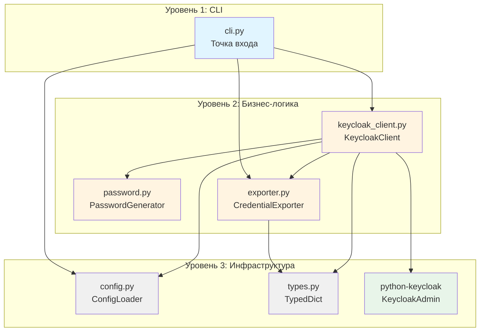

# Архитектура kk-userator v2.0

**Дата:** 2026-03-22  
**Версия:** 2.0.0 (рефакторинг)  
**Статус:** Утверждено (после ревью)

---

## Цели рефакторинга

### Основные проблемы текущей архитектуры (v1.1.0)

1. **Низкая тестируемость:**
   - Жёстко зашитый `input()` в функциях `get_credentials_from_input()`
   - Глобальное состояние через `logging.getLogger()`
   - Прямое использование `os.makedirs()` вместо `pathlib.Path`

2. **Отсутствие внедрения зависимостей:**
   - Классы создают свои зависимости внутри конструктора
   - Невозможно подменить зависимости для тестирования
   - Тесная связанность между компонентами

3. **Монолитная структура:**
   - Весь код в одном файле (`keycloak_user_generator.py`, 968 строк)
   - Смешение ответственности (CLI, бизнес-логика, работа с API)

4. **Отсутствие типизации:**
   - Словари `Dict[str, Any]` вместо строгих типов
   - Нет гарантии корректности структуры данных

### Целевые показатели v2.0

| Показатель | Текущее значение | Целевое значение |
|------------|------------------|------------------|
| Строк в файле | 968 | ≤200 на модуль |
| Покрытие тестами | 0% | >80% |
| Модулей | 2 | 6 |
| Внедрение зависимостей | Отсутствует | Через конструктор |
| Типизация | Частичная | Полная (TypedDict) |

---

## Структура модулей

### Дерево файлов (v2.0)

```
kk-userator/
├── keycloak_userator/
│   ├── __init__.py              # Пакет, версии, экспорты
│   ├── cli.py                   # Точка входа, CLI, парсинг аргументов
│   ├── config.py                # Загрузка конфигурации (без изменений)
│   ├── types.py                 # TypedDict для структур данных
│   ├── password.py              # Генератор паролей
│   ├── exporter.py              # Экспорт в CSV/TXT/JSON
│   └── keycloak_client.py       # Клиент Keycloak API
├── tests/
│   ├── __init__.py
│   ├── test_password.py
│   ├── test_exporter.py
│   ├── test_keycloak_client.py
│   └── test_cli.py
├── config.yaml
├── requirements.txt
└── README.md
```

### Описание модулей

#### 1. `cli.py` (≈150 строк)

**Ответственность:**
- Парсинг аргументов командной строки
- Загрузка конфигурации
- Сборка приложения через factory-функции
- Точка входа `main()`

**Зависимости:**
- `config.py` — для загрузки конфигурации
- `keycloak_client.py` — factory-функция `create_keycloak_client()`
- `exporter.py` — factory-функция `create_exporter()`

**Изменения относительно v1.1.0:**
- Удалена функция `get_credentials_from_input()` → инъекция через `stream`
- Удалена функция `get_credentials_from_env()` → чтение из `os.environ` в CLI
- Функция `main()` делегирует логику другим модулям

---

#### 2. `types.py` (≈50 строк)

**Ответственность:**
- Определение строго типизированных структур данных

**Ключевые типы:**

```python
from typing import TypedDict, Optional, List

class UserCredentials(TypedDict):
    """Учётные данные пользователя."""
    username: str
    password: str
    email: str
    firstName: str
    lastName: str
    enabled: bool

class ConnectionConfig(TypedDict):
    """Конфигурация подключения к Keycloak."""
    server_url: str
    username: str
    password: str
    realm: str

class GenerationStats(TypedDict):
    """Статистика генерации пользователей."""
    created: int
    skipped: int
    errors: int
    total: int

class UserDataInput(TypedDict, total=False):
    """Вводные данные для генерации пользователя."""
    number: int
    password: str
    group_id: Optional[str]
```

**Обоснование:**
- TypedDict обеспечивает проверку типов на этапе статического анализа (mypy)
- Уменьшает количество ошибок времени выполнения
- Улучшает автодополнение в IDE

---

#### 3. `password.py` (≈80 строк)

**Ответственность:**
- Генерация криптографически безопасных паролей

**Интерфейс:**

```python
class PasswordGenerator:
    def __init__(self, length: int, charsets: Dict[str, str]):
        """
        Args:
            length: Длина пароля
            charsets: Словарь наборов символов
                      {'lowercase': 'abc...', 'digits': '012...'}
        """

    def generate(self) -> str:
        """Генерация одного пароля."""

    def generate_batch(self, count: int) -> List[str]:
        """Генерация нескольких паролей."""
```

**Изменения относительно v1.1.0:**
- Убрана зависимость от `Config` → передача параметров в конструктор
- Явное указание наборов символов вместо булевых флагов
- Упрощение тестирования через инъекцию параметров

---

#### 4. `exporter.py` (≈120 строк)

**Ответственность:**
- Экспорт данных пользователей в файлы

**Интерфейс:**

```python
class CredentialExporter:
    def __init__(self, output_dir: Path, logger: Optional[logging.Logger] = None):
        """
        Args:
            output_dir: Директория для файлов (pathlib.Path)
            logger: Логгер для записи событий
        """

    def export_csv(self, users: List[UserCredentials]) -> Path:
        """Экспорт в CSV."""

    def export_txt(self, users: List[UserCredentials]) -> Path:
        """Экспорт в TXT."""

    def export_json(self, users: List[UserCredentials]) -> Path:
        """Экспорт в JSON."""
```

**Изменения относительно v1.1.0:**
- `os.makedirs()` → `Path.mkdir(parents=True, exist_ok=True)`
- Инъекция логгера вместо глобального `logging.getLogger()`
- Возврат `Path` вместо `str` для типов безопасности
- Использование `UserCredentials` TypedDict вместо `Dict[str, Any]`

---

#### 5. `keycloak_client.py` (≈250 строк)

**Ответственность:**
- Подключение к Keycloak Admin API
- CRUD-операции с пользователями
- Управление группами

**Интерфейс:**

```python
class KeycloakClient:
    def __init__(
        self,
        keycloak_admin: KeycloakAdmin,
        logger: logging.Logger,
        dry_run: bool = False
    ):
        """
        Args:
            keycloak_admin: Инициализированный клиент Keycloak Admin API
            logger: Логгер для записи событий
            dry_run: Режим сухой проверки
        """

    def connect(self) -> bool:
        """Проверка подключения."""

    def get_or_create_group(self, group_name: str) -> Optional[str]:
        """Получение или создание группы."""

    def user_exists(self, username: str) -> bool:
        """Проверка существования пользователя."""

    def create_user(self, user_data: UserCredentials, group_id: Optional[str]) -> bool:
        """Создание пользователя."""

    def generate_users(
        self,
        count: int,
        start_number: int,
        password_gen: PasswordGenerator
    ) -> List[UserCredentials]:
        """Массовая генерация пользователей."""
```

**Factory-функция:**

```python
def create_keycloak_client(
    server_url: str,
    username: str,
    password: str,
    realm: str,
    dry_run: bool = False,
    logger: Optional[logging.Logger] = None
) -> Optional[KeycloakClient]:
    """
    Factory-функция для создания клиента.

    Args:
        server_url: URL Keycloak
        username: Логин администратора
        password: Пароль администратора
        realm: Имя realm
        dry_run: Режим сухой проверки
        logger: Логгер

    Returns:
        KeycloakClient или None при ошибке подключения
    """
```

**Изменения относительно v1.1.0:**
- Разделение ответственности: `KeycloakUserGenerator` → `KeycloakClient` + `PasswordGenerator` + `CredentialExporter`
- Инъекция `KeycloakAdmin` вместо создания внутри класса
- Инъекция логгера вместо глобального состояния
- Поддержка `dry_run` через параметр конструктора

---

#### 6. `config.py` (без изменений, ≈400 строк)

**Ответственность:**
- Загрузка конфигурации из YAML
- Валидация параметров
- Переопределение через переменные окружения

**Изменения:**
- Фактически без изменений (модуль уже соответствует требованиям)
- Возможно: перемещение в подпакет `keycloak_userator/config.py`

---

## Диаграмма компонентов



### Пояснения к диаграмме

| Уровень | Компоненты | Описание |
|---------|------------|----------|
| **CLI** | `cli.py` | Точка входа, координирует работу |
| **Бизнес-логика** | `keycloak_client.py`, `password.py`, `exporter.py` | Основная логика приложения |
| **Инфраструктура** | `config.py`, `types.py`, `python-keycloak` | Базовые зависимости |

**Направленность зависимостей:** Сверху вниз (CLI → Бизнес-логика → Инфраструктура)

**Циклические зависимости:** Отсутствуют

---

## Внедрение зависимостей

### Принципы

1. **Явная передача зависимостей:**
   - Все зависимости передаются через конструктор
   - Никакого скрытого создания зависимостей внутри методов

2. **Опциональность через `Optional`:**
   - Зависимости, которые могут отсутствовать, объявляются как `Optional[T]`
   - Значение по умолчанию: `None`

3. **Factory-функции для упрощения:**
   - Сложные зависимости создаются через factory-функции
   - Factory-функции инкапсулируют логику создания

### Примеры внедрения

#### Пример 1: PasswordGenerator

**v1.1.0 (плохо):**

```python
class PasswordGenerator:
    def __init__(self, config: Config):
        self.length = config.password.length
        self.chars = self._build_char_set(config)
```

**v2.0 (хорошо):**

```python
class PasswordGenerator:
    def __init__(self, length: int = 8, charsets: Optional[Dict[str, str]] = None):
        self.length = length
        self.charsets = charsets or self._default_charsets()

    def _default_charsets(self) -> Dict[str, str]:
        return {
            'lowercase': string.ascii_lowercase,
            'uppercase': string.ascii_uppercase,
            'digits': string.digits
        }
```

**Преимущества:**
- Упрощение тестирования: `PasswordGenerator(length=4)` для тестов
- Нет зависимости от `Config`
- Гибкая настройка наборов символов

---

#### Пример 2: CredentialExporter

**v1.1.0 (плохо):**

```python
class CredentialExporter:
    def __init__(self, output_dir: str = "output"):
        self.output_dir = output_dir
        os.makedirs(output_dir, exist_ok=True)  # Побочный эффект!
```

**v2.0 (хорошо):**

```python
class CredentialExporter:
    def __init__(self, output_dir: Path, logger: Optional[logging.Logger] = None):
        self.output_dir = output_dir
        self.logger = logger or logging.getLogger(__name__)
        # Создание директории вынесено в метод export_*()

    def _ensure_output_dir(self) -> None:
        self.output_dir.mkdir(parents=True, exist_ok=True)
```

**Преимущества:**
- Нет побочного эффекта в конструкторе
- `pathlib.Path` вместо `str` для типов безопасности
- Инъекция логгера для тестирования

---

#### Пример 3: KeycloakClient

**v1.1.0 (плохо):**

```python
class KeycloakUserGenerator:
    def __init__(self, server_url: str, ..., config: Config):
        self.keycloak_admin = KeycloakAdmin(...)  # Создание внутри!
```

**v2.0 (хорошо):**

```python
class KeycloakClient:
    def __init__(
        self,
        keycloak_admin: KeycloakAdmin,
        logger: logging.Logger,
        dry_run: bool = False
    ):
        self.keycloak_admin = keycloak_admin
        self.logger = logger
        self.dry_run = dry_run


# Factory-функция для упрощения использования
def create_keycloak_client(
    server_url: str,
    username: str,
    password: str,
    realm: str,
    dry_run: bool = False,
    logger: Optional[logging.Logger] = None
) -> Optional[KeycloakClient]:
    keycloak_admin = KeycloakAdmin(
        server_url=f"{server_url}/",
        username=username,
        password=password,
        realm_name=realm
    )
    return KeycloakClient(keycloak_admin, logger or logging.getLogger(), dry_run)
```

**Преимущества:**
- Явная зависимость от `KeycloakAdmin`
- Возможность подмены для тестирования (mock)
- Factory-функция для удобного использования в production

---

## План миграции

### Этап 0: Написание тестов (покрытие >80%)

**Цель:** Обеспечить безопасность рефакторинга

**Задачи:**
1. Настроить pytest и pytest-cov
2. Написать тесты для `PasswordGenerator`:
   - Тест генерации одного пароля
   - Тест генерации батча
   - Тест валидации длины
3. Написать тесты для `CredentialExporter`:
   - Тест экспорта в CSV
   - Тест экспорта в TXT
   - Тест экспорта в JSON
4. Написать интеграционные тесты для `KeycloakUserGenerator`:
   - Мок KeycloakAdmin
   - Тест создания пользователя
   - Тест идемпотентности

**Критерий завершения:**
- `pytest --cov=keycloak_userator --cov-report=term-missing` показывает >80%

---

### Этап 1: Механическое разделение (без изменений API)

**Цель:** Разделить код на модули без изменения логики

**Задачи:**
1. Создать структуру пакетов:
   ```bash
   mkdir keycloak_userator tests
   touch keycloak_userator/__init__.py tests/__init__.py
   ```

2. Механически переместить классы в отдельные файлы:
   - `PasswordGenerator` → `password.py`
   - `CredentialExporter` → `exporter.py`
   - `KeycloakUserGenerator` → `keycloak_client.py`
   - CLI-функции → `cli.py`

3. Обновить импорты в `cli.py`:
   ```python
   from keycloak_userator.password import PasswordGenerator
   from keycloak_userator.exporter import CredentialExporter
   from keycloak_userator.keycloak_client import KeycloakUserGenerator
   ```

4. Запустить тесты — все должны проходить

**Критерий завершения:**
- Все тесты проходят
- `git diff` показывает только перемещение кода

---

### Этап 2: Внедрение DI (сломать API, обновить CLI)

**Цель:** Внедрить зависимости через конструктор

**Задачи:**
1. Рефакторинг `PasswordGenerator`:
   - Убрать зависимость от `Config`
   - Принимать `length` и `charsets` в конструктор

2. Рефакторинг `CredentialExporter`:
   - Заменить `str` на `Path`
   - Инъекция логгера
   - Убрать побочный эффект из конструктора

3. Рефакторинг `KeycloakClient`:
   - Инъекция `KeycloakAdmin`
   - Инъекция логгера
   - Выделение factory-функции

4. Обновление `cli.py`:
   - Использовать factory-функции
   - Передать зависимости явно

5. Обновить тесты под новый API

**Критерий завершения:**
- Все тесты проходят
- Новый API используется в `main()`

---

### Этап 3: Улучшения (TypedDict, декораторы)

**Цель:** Улучшить типизацию и читаемость

**Задачи:**
1. Создать `types.py`:
   - `UserCredentials`
   - `ConnectionConfig`
   - `GenerationStats`

2. Обновить сигнатуры методов:
   ```python
   def create_user(self, user_data: UserCredentials) -> bool:
   ```

3. Добавить декораторы для обработки ошибок:
   ```python
   def handle_keycloak_errors(func):
       @wraps(func)
       def wrapper(*args, **kwargs):
           try:
               return func(*args, **kwargs)
           except KeycloakError as e:
               logger.error(f"Keycloak error: {e}")
               return False
       return wrapper
   ```

4. Запустить mypy для проверки типов:
   ```bash
   mypy keycloak_userator/ --strict
   ```

**Критерий завершения:**
- `mypy` не выдаёт ошибок
- Все тесты проходят

---

## Риски и mitigation

| Риск | Вероятность | Влияние | Mitigation |
|------|-------------|---------|------------|
| **Сломан обратный совместимость** | Высокая | Среднее | - Сохранить старый API как deprecated<br>- Обновить документацию миграции |
| **Потеря функциональности при рефакторинге** | Средняя | Высокое | - Написать тесты перед рефакторингом (Этап 0)<br>- Поэтапное внедрение с проверкой после каждого этапа |
| **Увеличение сложности кода** | Средняя | Низкое | - Использовать factory-функции для упрощения<br>- Документировать каждый класс |
| **Падение производительности** | Низкая | Низкое | - Профилирование после Этапа 2<br>- Оптимизация узких мест при необходимости |
| **Ошибки типизации** | Средняя | Среднее | - Постепенное внедрение TypedDict<br>- Использование `mypy --strict` |

---

## Архитектурные решения (ADR)

### ADR-001: Использование TypedDict вместо dataclasses

**Статус:** Принято  
**Дата:** 2026-03-22

**Контекст:**
В v1.1.0 используются словари `Dict[str, Any]` для передачи данных пользователей. Это приводит к ошибкам времени выполнения и отсутствию автодополнения в IDE.

**Решение:**
Использовать `TypedDict` из модуля `typing` для определения структур данных.

**Преимущества:**
- Проверка типов на этапе статического анализа (mypy)
- Автодополнение в IDE
- Меньше бойлерплейта по сравнению с dataclasses
- Совместимость со словарями (можно передавать `dict` в функции)

**Недостатки:**
- Проверка типов только на этапе анализа, не во время выполнения
- Меньше возможностей для валидации данных

**Альтернативы:**
- `dataclasses` — больше бойлерплейта, валидация в runtime
- `pydantic` — тяжеловесное решение для простого скрипта

---

### ADR-002: Внедрение зависимостей через конструктор

**Статус:** Принято  
**Дата:** 2026-03-22

**Контекст:**
В v1.1.0 классы создают свои зависимости внутри конструктора, что делает тестирование невозможным без моков сложных объектов.

**Решение:**
Все зависимости передавать через конструктор. Для упрощения использования предоставить factory-функции.

**Преимущества:**
- Упрощение тестирования (можно передать mock)
- Явные зависимости класса
- Гибкость настройки

**Недостатки:**
- Увеличение количества параметров в конструкторе
- Необходимость factory-функций для удобного использования

**Альтернативы:**
- Service Locator — скрытая зависимость, антипаттерн
- Глобальное состояние — невозможно тестировать

---

### ADR-003: Использование pathlib.Path вместо os.path

**Статус:** Принято  
**Дата:** 2026-03-22

**Контекст:**
В v1.1.0 используется `os.path.join()` и `os.makedirs()`, что менее типобезопасно и требует импорта нескольких функций.

**Решение:**
Использовать `pathlib.Path` для всех операций с путями.

**Преимущества:**
- Объектно-ориентированный API
- Типобезопасность
- Меньше импортов (`from pathlib import Path`)
- Кроссплатформенность

**Недостатки:**
- Минимальные: незначительное изменение API

**Альтернативы:**
- `os.path` — менее выразительный API
- `py.path` — дополнительная зависимость

---

## Заключение

Архитектура v2.0 обеспечивает:

1. **Модульность:** 6 независимых модулей с чёткой ответственностью
2. **Тестируемость:** Внедрение зависимостей позволяет легко тестировать каждый компонент
3. **Типобезопасность:** TypedDict и `pathlib.Path` уменьшают количество ошибок
4. **Поддерживаемость:** Разделение ответственности упрощает внесение изменений
5. **Масштабируемость:** Архитектура позволяет добавлять новые функции без переписывания существующего кода

**Следующий шаг:** Реализация Плана миграции (Этап 0 → Этап 3)
